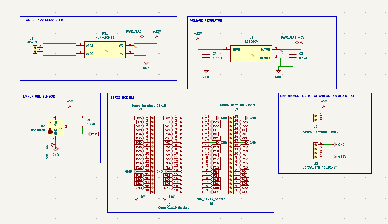

# SmartBin - Automated Organic Waste Processor 
## Overview

SmartBin is an automated system that converts organic waste into compost through a controlled drying and grinding process. The system features odor control using carbon filtration, automated waste level detection, and a custom-designed ESP32-based motherboard for complete process automation.

**Key Features:**
- Automated waste level monitoring using ultrasonic sensors
- Odor control system with carbon filter and exhaust fan
- Controlled drying via 50W heating element
- Automated grinding using 120W AC blender motor with PWM speed control
- Custom PCB design with high/low-voltage isolation
- FreeRTOS-based task management

---

## System Architecture



*System Schematic*

### Process Flow:
1. **Waste Collection** → Ultrasonic sensor monitors fill level
2. **Odor Filtration** → Fan pulls air through carbon filter before exhaust
3. **Drying Stage** → Heating element activates at threshold level
4. **Grinding Stage** → AC motor pulverizes dried waste
5. **Storage** → Processed compost collected in separate compartment

---

## Hardware Design

### Custom Motherboard (KiCad)


*Top layer of SmartBin control board*


*Bottom layer showing power traces and isolation*

**Board Specifications:**
- **Controller:** ESP32-WROOM-32
- **Power Input:** 220V AC mains
- **AC Loads:** 120W blender motor, 50W heating element
- **DC Loads:** 5V fan, 3.3V control logic
- **Protection:** Fuse, optoisolators, flyback diodes
- **PCB Layers:** 2-layer, FR4
- **Dimensions:** [Add dimensions in mm]

### Key Components:

| Component | Purpose | Interface |
|-----------|---------|-----------|
| ESP32 | Main controller | - |
| HC-SR04 | Waste level detection | GPIO |
| TRIAC + Optocoupler | AC motor speed control | PWM |
| Solid State Relay | Heating element control | GPIO |
| 12V/5V Regulators | DC power supply | - |
| Current Sensor | Motor load monitoring | ADC |

### Power Distribution:
```
220V AC ─┬─► AC Motor (via TRIAC dimmer)
         ├─► 50W Heater (via SSR)
         └─► AC-DC Converter ──► 12V ──► 5V ──► 3.3V ESP32
                                      ├─► Fan
                                      └─► Sensors
```
---

### Hardware Setup:

1. **Fabricate PCB:** Upload Gerber files to JLCPCB
2. **Solder Components:** Follow assembly drawing
3. **Connect Sensors:** Wire ultrasonic sensor to designated headers
4. **Power Connections:** 220V AC input via terminal block
5. **Motor Connection:** AC motor to TRIAC output
6. **Heater Connection:** Heating element to SSR output


## Testing & Validation

| Test | Method | Result |
|------|--------|--------|
| Motor speed control | Oscilloscope (PWM waveform) | ±5% accuracy |
| Temperature regulation | Thermocouple logging | ±2°C |
| Level detection | Manual measurement vs sensor | ±2mm |
| Power consumption | AC power meter | 125W max |
| Cycle time | Full dry → grind cycle | 45-60 min |

---

## Challenges & Solutions

| Challenge | Solution |
|-----------|----------|
| AC motor EMI interfering with ESP32 | Added optoisolation, separate ground planes |
| Heating element overshoot | Implemented PID control instead of bang-bang |
| Moisture damage to electronics | Enclosed PCB in sealed compartment |
| Inrush current on motor start | Added soft-start PWM ramp |

---
## Future Improvements

- [ ] WiFi connectivity for remote monitoring
- [ ] Mobile app integration for status alerts
- [ ] Solar power compatibility
- [ ] Automatic compost quality sensing
- [ ] Multiple bin capacity expansion
- [ ] Machine learning for optimal cycle prediction

## Author

**Fatai Oyetunji**  
Computer Science, University of Lagos  
[GitHub](https://github.com/ola-oye) | [LinkedIn](https://linkedin.com/in/olasunkanmi)

---

## Acknowledgments

- University of Lagos Computer Science Department
- NitHub, University of Lagos
- Project supervisor and team members
- Open-source KiCad and ESP32 communities

---

**⭐ If you found this project useful, consider giving it a star!**